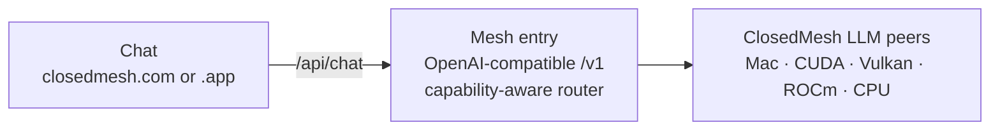

# ClosedMesh

**Open peer-to-peer LLM. Anyone can chat. Anyone with a capable machine
can run a node and add compute to the mesh.**

ClosedMesh is one open mesh of laptops, workstations, and GPU boxes
serving open-weight models. The chat UI runs in any browser; inference
runs end-to-end on a peer in the network whose hardware fits the model.
There's no central GPU cluster, no cloud provider account, no
third-party AI API in the loop, and no signup — prompts are not tied
to an identity, and the runtime is open source so what each peer can
do is auditable.

It's built for the work open-weight models already do well — summarizing
documents and codebases, classifying and labeling data at scale,
long-running background agents, synthetic-data generation — where keeping
data in-house and keeping per-token costs flat matter more than shaving a
second off every reply.

Apple Silicon is the hero hardware: an M-series Mac with 36–128 GB of
unified memory turns a $2.5–4.5k laptop into a 30B–70B-capable
inference box at speeds Windows GPU setups at the same price can't
match. CUDA / ROCm / Vulkan boxes happily join too — the mesh routes
each request to whichever peer can serve it best.

This repo contains the chat surface — a Next.js app deployed at
[closedmesh.com](https://closedmesh.com) and bundled inside the
[ClosedMesh desktop app](https://closedmesh.com/download). The
peer-to-peer inference runtime lives at
[`closedmesh/closedmesh-llm`](https://github.com/closedmesh/closedmesh-llm)
and ships as the `closedmesh` binary.

## Use it

Three ways, pick one:

- **Just chat.** Open [closedmesh.com](https://closedmesh.com) and type.
  No install, no account, no setup.
- **Desktop app.** Download from
  [closedmesh.com/download](https://closedmesh.com/download). Same chat
  as the website plus a tray icon that shows mesh status. If you opt in,
  the app installs the runtime on your machine — chat works offline and
  your hardware contributes to the mesh.
- **CLI / server.** Run the runtime directly:

  ```bash
  # macOS / Linux / WSL2
  curl -fsSL https://closedmesh.com/install | sh

  # Windows (PowerShell, no admin needed)
  iwr -useb https://closedmesh.com/install.ps1 | iex
  ```

  Add `-s -- --service` (or `closedmesh-install -Service` on Windows) to
  register an autostart unit. The node joins the public mesh on launch
  and the desktop app opens the local controller.

## Architecture



The chat UI calls its own same-origin `/api/chat`. The Vercel deployment
proxies that to the public mesh entry; the desktop app's bundled
controller proxies it to either the public mesh or the local runtime,
depending on how it was launched.

The router only dispatches a request to peers that can actually serve
it. **Full-quality replication is the default**: each model runs
end-to-end on a single peer whose hardware fits it, so the per-token
critical path stays inside one machine and never crosses the public
internet. The mesh's job is to find the best peer for each session,
not to stitch weights across slow links. Offline peers are routed
around automatically.

The runtime can also pair two peers per session via **speculative
decoding** — a small fast draft peer proposes tokens that a larger
verifier peer accepts in batched passes — which is the only multi-peer
mode that pays off on residential WAN, because the network hop
amortises across many tokens. Pipeline parallel and MoE expert
sharding are still in the runtime as a power-user fallback for models
that don't fit on any single peer (see
[`closedmesh-llm`](https://github.com/closedmesh/closedmesh-llm)),
but they are no longer the default route.

Because anyone can join, the mesh **verifies that a peer actually runs
the model it advertises**. Each peer publishes a deterministic
model-identity fingerprint, and the network re-runs an unpredictable
synthetic probe and compares — so a peer can't claim a large model while
quietly serving a smaller one or canned text. Verification uses only
synthetic probes, never real user prompts. The mechanism lives in the
runtime ([model-identity verification](https://github.com/closedmesh/closedmesh-llm/blob/main/docs/VERIFICATION.md)).

## Privacy & trust

ClosedMesh keeps prompts off third-party AI APIs, but it's a peer-to-peer
mesh — not a hosted service behind a privacy contract — so it's worth being
precise about what that does and doesn't buy you:

- **No third-party AI provider in the default path.** Mesh-routed requests
  run on contributor hardware; no OpenAI / Anthropic / Google in the loop.
- **Pseudonymous.** No signup, no login. A peer doesn't know who you are
  unless your prompt reveals it, and sessions aren't tied to an identity.
- **The serving peer reads your prompt.** Inference requires it, and the
  operator of the peer your session lands on has physical access to that
  machine. There is no enclave/TEE isolation in the default mesh today, so
  the honest answer is: for anything you don't want another operator to be
  able to read, run your own peer — the runtime others run is the runtime
  you can run yourself.
- **Verification proves model identity, not non-snooping.** The mesh proves
  a peer runs the model it claims (synthetic probes only, never your
  prompts); it does not stop that peer's operator from reading traffic on
  their own box.

The full threat model is at
[closedmesh.com/security](https://closedmesh.com/security). An optional,
opt-in **confidential (TEE-attested) tier** — for sensitive in-house
workloads that need prompt confidentiality from the peer operator — is on
the roadmap (design in progress, not yet built).

## Hardware support

The installer detects your platform and pulls the matching runtime
build:

| OS               | Hardware                  | Backend |
| ---------------- | ------------------------- | ------- |
| macOS            | Apple Silicon             | Metal   |
| Linux            | x86_64 · NVIDIA           | CUDA    |
| Linux            | x86_64 · AMD              | ROCm    |
| Linux            | x86_64 · Intel / Vulkan   | Vulkan  |
| Linux            | x86_64 · CPU-only         | CPU     |
| Linux            | aarch64                   | Vulkan / CPU |
| Windows 10/11    | x86_64 · NVIDIA           | CUDA    |
| Windows 10/11    | x86_64 · AMD / Intel      | Vulkan  |
| WSL2             | x86_64 · NVIDIA           | CUDA    |

You can override the auto-detection with
`CLOSEDMESH_BACKEND=cuda|rocm|vulkan|cpu` when running the installer.

## Run the chat app from this repo

```bash
npm install
cp .env.example .env.local
./scripts/dev.sh
```

`scripts/dev.sh` starts the runtime in the background if it isn't
already running, then boots the Next.js dev server.

## Configuration

| env var                            | default                      | what it does                       |
| ---------------------------------- | ---------------------------- | ---------------------------------- |
| `CLOSEDMESH_RUNTIME_URL`           | `http://127.0.0.1:9337/v1`   | OpenAI-compat base URL             |
| `CLOSEDMESH_ADMIN_URL`             | `http://127.0.0.1:3131`      | Admin endpoint used for topology   |
| `CLOSEDMESH_RUNTIME_TOKEN`         | _(unset)_                    | Bearer token forwarded to the runtime when proxying through a public auth gateway |
| `CLOSEDMESH_MODEL`                 | _(first model from /models)_ | Pin a specific model id            |
| `CLOSEDMESH_BIN`                   | _(auto-detected)_            | Path to the `closedmesh` binary    |
| `NEXT_PUBLIC_DEPLOYMENT`           | _(unset)_                    | Set to `public` on Vercel — disables the local-only `/control` pages |
| `CLOSEDMESH_PUBLIC_ORIGINS`        | `https://closedmesh.com`     | Comma-separated origins allowed to call the controller's `/api/chat` and `/api/status` cross-origin |

The previous `MESH_LLM_URL`, `MESH_CONSOLE_URL`, `MESH_LLM_MODEL`, and
`FORGEMESH_BIN` names are still honored as deprecated fallbacks.

## Project layout

```
app/                 — Next.js App Router pages and API routes
  (public)/          — closedmesh.com pages (home, about, download)
  (control)/         — local-only dashboard (only loads when running on
                       your own machine via the desktop app or CLI)
  api/chat/          — OpenAI-compatible streaming proxy to the runtime
  api/status/        — node count + loaded models for the status pill
  components/        — UI building blocks
desktop/             — Tauri 2 desktop shell + bundled controller sidecar
public/install.sh    — what closedmesh.com/install serves
scripts/dev.sh       — one command to bring the whole stack up
.env.example         — copy to .env.local
```

## License

Apache-2.0 / MIT, dual-licensed. See `LICENSE-APACHE` and `LICENSE-MIT`.
